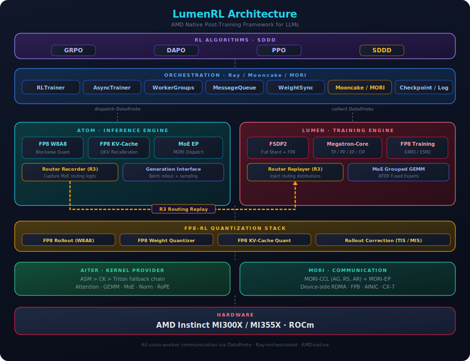
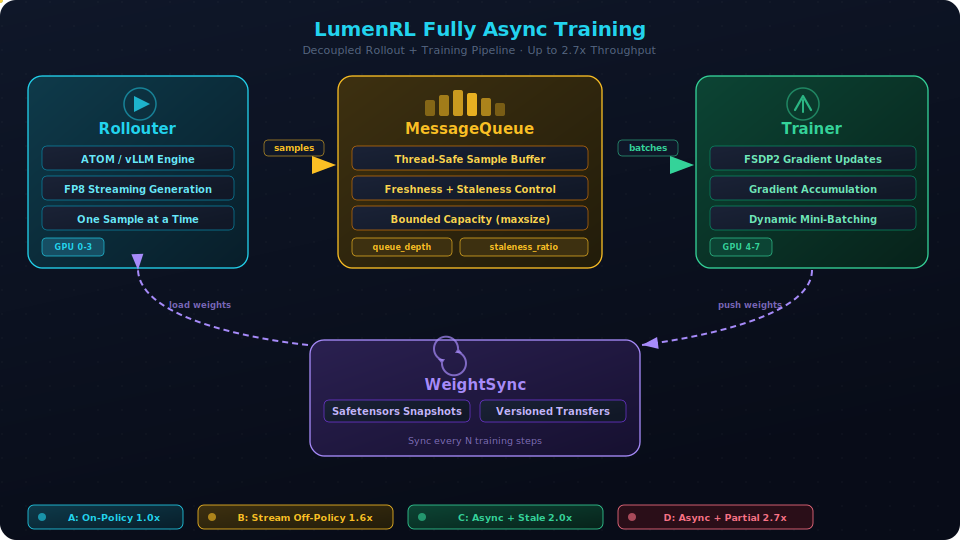

# LumenRL

An AMD native **Post-Training Framework for LLMs**, powered by [Lumen](https://github.com/ZhangDanyang-AMD/Lumen) (quantized training) and [ATOM](https://github.com/ROCm/ATOM) (optimized inference). LumenRL supports both **RL post-training** (GRPO, DAPO, PPO) and **Speculative Decoding Draft Distillation (SDDD)** on AMD GPUs.

---

## 📢 News

- **[2026/05]** LumenRL now supports **Speculative Decoding Draft Distillation (SDDD)** — Eagle3 draft distillation for Kimi K2.5 and Qwen3-8B on MI350 with [Mooncake](https://github.com/kvcache-ai/Mooncake)/MORI RDMA transfer
- **[2026/04]** LumenRL now supports **fully async training** — inspired by [VERL](https://github.com/verl-project/verl), decouples rollout and training for up to 2.7× throughput improvement
- **[2026/03]** LumenRL now supports **MoE [R3](https://arxiv.org/abs/2510.11370) router alignment** — Rollout Routing Replay for stable MoE RL training
- **[2026/03]** LumenRL now supports the **[FP8-RL](https://arxiv.org/abs/2601.18150) quantization stack** — FP8 rollout + training with TIS/MIS importance-sampling correction

## 📑 Table of Contents

- [Features](#-features)
- [Architecture](#architecture)
- [Key Features](#key-features)
- [Supported Models](#supported-models)
  - [RL Models](#rl-models)
  - [SDDD Models](#sddd-models)
- [Requirements](#requirements)
- [Quick Start](#quick-start)
- [Fully Async Training](#fully-async-training)
- [Quantization](#quantization)
- [MoE Training with R3](#moe-training-with-r3)
- [Backend Support Matrix](#backend-support-matrix)
- [Third-Party Libraries](#third-party-libraries)
- [Citation](#citation)
- [Acknowledgements](#acknowledgements)
- [License](#license)

## 🚀 Features

- **AMD-Native**: Built for ROCm with [AITER](https://github.com/ROCm/aiter) kernels (ASM / CK / Triton) and [MORI](https://github.com/ROCm/mori) communication (RDMA + GPU collective ops, MoE expert dispatch)
- **Quantization End-to-End**: Quantized rollout (FP8, MXFP8, MXFP4) and quantized training with importance-sampling rollout correction (TIS/MIS) — up to 44% throughput gain over BF16
- **MoE-Stable RL**: Rollout Routing Replay (R3) aligns train/inference routers to prevent MoE training collapse
- **Speculative Decoding Draft Distillation (SDDD)**: Train Eagle3/DFlash draft models via teacher hidden-state distillation with [Mooncake](https://github.com/kvcache-ai/Mooncake)/MORI RDMA transfer
- **Flexible Backends**: FSDP2 or Megatron-Core training, ATOM/SGLang/vLLM inference with TP/EP/DP parallelism

## Architecture

<div align="center">
  
</div>

## Key Features

| Category | Features |
|---|---|
| **Training Backends** | FSDP2, Megatron-Core — with Lumen quantized training and AITER kernels |
| **Inference Engine** | ATOM / SGLang / vLLM — quantized rollout, MoE expert parallel, speculative decoding, piecewise torch.compile |
| **RL Algorithms** | GRPO, DAPO, PPO |
| **SDDD** | Eagle3/DFlash draft distillation, Mooncake/MORI RDMA hidden-state transfer |
| **Quantization** | FP8 (blockwise W8A8), MXFP8, MXFP4, FP8 KV-cache, FP8 training (hybrid E4M3/E5M2), rollout correction (TIS/MIS) |
| **MoE** | R3 router alignment, MORI-EP expert parallel, fused routing + aux loss |
| **Parallelism** | TP, EP, DP, FSDP2, sequence parallelism, context parallelism |
| **Hardware** | AMD Instinct MI250/MI300/MI350 (ROCm) |

## Supported Models

### RL Models

| Model Family | Architecture | Dense/MoE | FP8 Rollout | FP8 Training | R3 |
|---|---|---|---|---|---|
| Llama 3.x | `LlamaForCausalLM` | Dense | Yes | Yes | N/A |
| Qwen3 | `Qwen3ForCausalLM` | Dense | Yes | Yes | N/A |
| Qwen3-MoE | `Qwen3MoeForCausalLM` | MoE | Yes | Yes | Yes |
| DeepSeek V2/V3 | `DeepseekV3ForCausalLM` | MoE | Yes | Yes | Yes |
| Mixtral | `MixtralForCausalLM` | MoE | Yes | Yes | Yes |
| GLM-4-MoE | `Glm4MoeForCausalLM` | MoE | Yes | Yes | Yes |

### SDDD Models

| Teacher Model | Draft Architecture | Inference Backend | Transfer |
|---|---|---|---|
| Kimi K2.5 (1T MoE) | Eagle3 | SGLang+ATOM / vLLM | Mooncake / MORI |
| Qwen3-8B | Eagle3 | vLLM | MORI |

## Requirements

- AMD GPU with ROCm support (MI250 / MI300 / MI350 series)
- Docker (recommended) or bare-metal ROCm installation
- Python >= 3.10

## Quick Start

### Option A: Docker (Recommended)

```bash
docker pull rocm/atom-dev:latest

docker run -it --network=host \
  --device=/dev/kfd --device=/dev/dri \
  --group-add video --cap-add=SYS_PTRACE \
  --security-opt seccomp=unconfined \
  --shm-size=16G \
  -v $HOME:/home/$USER \
  rocm/atom-dev:latest

# Inside container
git clone https://github.com/ZhangDanyang-AMD/Lumen-RL.git && cd Lumen-RL
pip install -e ".[all]"
```

### Option B: Developer Install

```bash
git clone https://github.com/ZhangDanyang-AMD/Lumen-RL.git && cd Lumen-RL

# Editable install with all dependencies (installs lumen + atom)
pip install -e ".[all]"

# Or minimal install
pip install -e "."
```

### Run GRPO

```bash
# BF16 baseline (single GPU)
python examples/run_grpo.py --config configs/grpo_dense_bf16.yaml

# FP8 end-to-end (single GPU)
python examples/run_grpo.py --config configs/grpo_dense_fp8.yaml

# 8 GPUs
python examples/run_grpo.py --config configs/grpo_dense_fp8_8gpu.yaml

# MoE model with R3 + FP8
python examples/run_grpo.py --config configs/grpo_moe_fp8_r3.yaml
```

### Multi-Node with SLURM

```bash
NUM_NODES=2

COMMAND="python examples/run_grpo_moe.py \
    --config configs/grpo_moe_fp8_r3_multinode.yaml \
    cluster.num_nodes=$NUM_NODES \
    cluster.gpus_per_node=8 \
    policy.model_name=Qwen/Qwen3-30B-A3B \
    quantization.rollout.precision=fp8 \
    moe.r3.enabled=true \
    logger.wandb_enabled=true"

sbatch --nodes=$NUM_NODES --gres=gpu:8 scripts/ray.sub
```

## Fully Async Training

LumenRL supports **fully-async training** that decouples rollout and training for up to 2.7× throughput improvement, inspired by [VERL's fully_async_policy](https://github.com/verl-project/verl/blob/main/docs/advance/fully_async.md).

<div align="center">
  
</div>

Key features:
- **Parallel generation and training** — Rollouter generates while Trainer updates
- **Streaming samples** — Single-sample granularity with configurable batching
- **Staleness control** — Tunable `staleness_threshold` for freshness vs throughput tradeoff
- **Partial rollout** — Interrupt in-progress generation on weight sync to minimize wait
- **Filesystem weight sync** — safetensors snapshots for cross-process parameter transfer

```yaml
async_training:
  enabled: true
  require_batches: 4
  trigger_parameter_sync_step: 4
  staleness_threshold: 0.5
  partial_rollout: true
```

Four modes supported:

| Mode | Settings | Use Case |
| --- | --- | --- |
| On-policy | `staleness=0, sync_step=1` | Small-scale, stability-first |
| Stream off-policy | `staleness=0, sync_step>1` | Moderate throughput gain |
| Async + stale | `staleness>0, partial=False` | Large-scale, balanced |
| Async + partial | `staleness>0, partial=True` | Maximum throughput |

See [docs/advance/async_training.md](lumenrl-docs/docs/source/advance/async_training.md) for detailed configuration and tuning.

## Quantization

LumenRL implements a comprehensive quantization stack for low-precision post-training, including FP8, MXFP8, and MXFP4. The [FP8-RL](https://arxiv.org/abs/2601.18150) stack powers RL training, while MXFP8/MXFP4 online quantization via AITER enables efficient SDDD inference:

### FP8 Rollout (Inference)

- **Blockwise W8A8**: FP8 quantization for all linear layers in ATOM, with configurable first/last N layers in BF16
- **FP8 KV-Cache**: Per-step QKV scale recalibration (policy weights change every RL step)
- **On-the-fly weight quantization**: BF16 training weights are quantized to FP8 during weight sync to ATOM

```yaml
quantization:
  rollout:
    precision: fp8
    use_deep_gemm: true
    num_first_layers_in_bf16: 0
    num_last_layers_in_bf16: 0
```

### FP8 Training

- **Hybrid FP8**: E4M3 forward, E5M2 backward via Lumen's `QuantConfig`
- **Blockwise scaling**: DeepSeek-style sub-channel scaling
- **FP8 weight cache**: Optimizer hooks to avoid redundant re-quantization

```yaml
quantization:
  training:
    fp8: hybrid
    fp8_recipe: blockwise
    fp8_weight_cache: true
```

### Rollout Correction

FP8 rollout can deviate from the higher-precision training policy. LumenRL provides importance-sampling correction:

- **TIS** (Truncated Importance Sampling): Clips large ratios for stability
- **MIS** (Mean Importance Sampling): Normalizes ratios for unbiased estimates

```yaml
quantization:
  rollout_correction:
    enabled: true
    method: tis    # tis or mis
    clip: 1.5
```

## MoE Training with R3

MoE models suffer from routing inconsistency between inference (ATOM) and training (Lumen/Megatron), which can cause catastrophic RL training collapse. LumenRL implements [Rollout Routing Replay (R3)](https://arxiv.org/abs/2510.11370):

1. **Record**: During ATOM rollout, capture router logits and expert assignments at each MoE layer
2. **Transfer**: Package routing distributions alongside generated sequences in `DataProto`
3. **Replay**: During Lumen training, inject recorded routing distributions to align with inference behavior

```yaml
moe:
  r3:
    enabled: true
    record_router_logits: true
    replay_mode: distribution    # distribution or hard_assignment
```

R3 significantly reduces training-inference policy KL divergence and prevents collapse without compromising training speed.

## Backend Support Matrix

| Feature | FSDP2 | Megatron-Core |
|---|---|---|
| Dense FP8 training | Yes | Yes |
| MoE training | Limited | Yes (EP via MORI) |
| FP8 rollout (ATOM) | Yes | Yes |
| R3 router replay | Yes | Yes |
| LoRA | Yes | Yes |
| Multi-node | Yes | Yes |
| Expert parallel | No | Yes (MORI-EP) |
| Sequence parallelism | Yes | Yes |

## Third-Party Libraries

| Library | Package | Purpose |
|---|---|---|
| [Lumen](https://github.com/ZhangDanyang-AMD/Lumen) | `lumen` | AMD-native quantized training: FP8/MXFP8, AITER kernels, MORI comms |
| [ATOM](https://github.com/ROCm/ATOM) | `atom` | AITER-optimized inference: FP8, MXFP4, MoE EP, speculative decoding |
| [AITER](https://github.com/ZhangDanyang-AMD/aiter) | `amd-aiter` | GPU kernels: attention, GEMM, MoE, normalization (ASM/CK/Triton) |
| [MORI](https://github.com/ZhangDanyang-AMD/mori) | `mori` | RDMA + GPU communication: collectives, MoE expert dispatch |
| [Mooncake](https://github.com/kvcache-ai/Mooncake) | `mooncake` | Transfer engine: async RDMA/TCP hidden-state transport |
| [Ray](https://github.com/ray-project/ray) | `ray` | Distributed orchestration, resource management |

## Citation

If you use LumenRL in your research, please cite:

```bibtex
@misc{lumenrl,
  title   = {LumenRL: AMD Native Post-Training Framework for LLMs},
  year    = {2026},
  url     = {https://github.com/ZhangDanyang-AMD/Lumen-RL}
}
```

FP8-RL stack:

```bibtex
@article{fp8rl2026,
  title   = {FP8-RL: A Practical and Stable Low-Precision Stack for LLM Reinforcement Learning},
  author  = {Qiu, Zhaopeng and others},
  journal = {arXiv preprint arXiv:2601.18150},
  year    = {2026}
}
```

MoE R3 router alignment:

```bibtex
@article{r3moe2025,
  title   = {Stabilizing MoE Reinforcement Learning by Aligning Training and Inference Routers},
  author  = {Ma, Wenhan and Zhang, Hailin and Zhao, Liang and Song, Yifan and Wang, Yudong and Sui, Zhifang and Luo, Fuli},
  journal = {arXiv preprint arXiv:2510.11370},
  year    = {2025}
}
```

## Acknowledgements

LumenRL builds on the work of many open-source projects:

- [Lumen](https://github.com/ZhangDanyang-AMD/Lumen) — Quantized training lifecycle, AITER/MORI integration
- [ATOM](https://github.com/ROCm/ATOM) — Optimized inference engine, FP8/MXFP4/MoE support
- [AITER](https://github.com/ZhangDanyang-AMD/aiter) — AMD GPU kernels (ASM/CK/Triton)
- [MORI](https://github.com/ZhangDanyang-AMD/mori) — RDMA + GPU communication
- [Mooncake](https://github.com/kvcache-ai/Mooncake) — Async RDMA/TCP transfer engine

## License

Apache License 2.0

## Runtime Assembly Policy

LumenRL validates runtime assembly backends at startup when `assembly.strict_policy=true`:

- Training backend: `fsdp`, `fsdp2`, or `megatron`
- Inference backend: `atom`

Set `assembly.use_new_assembler=true` to use assembler-driven trainer construction.
